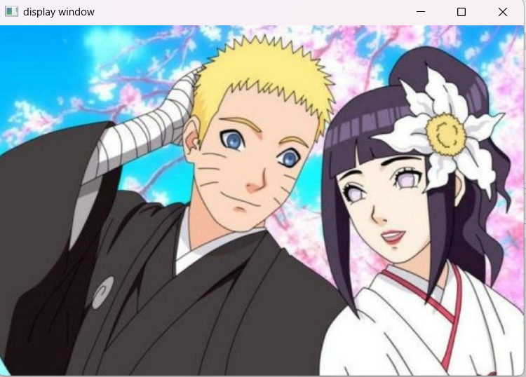
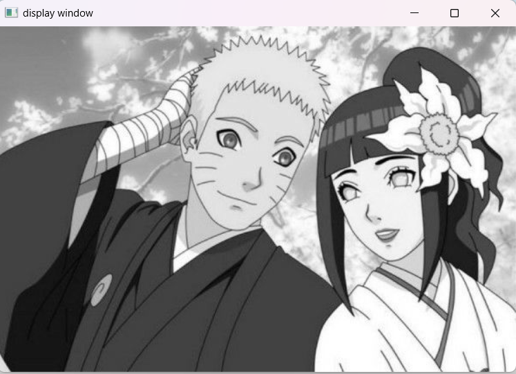
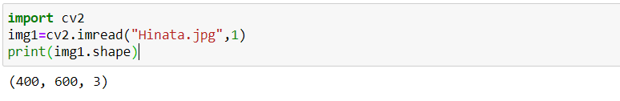
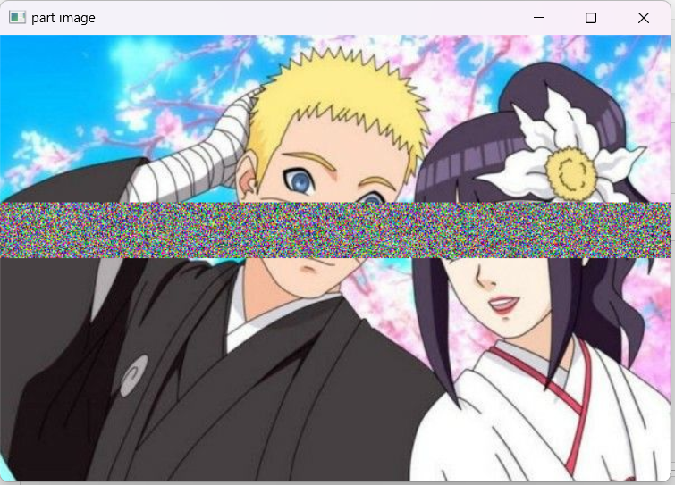
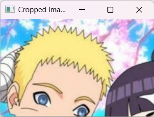

# COLOR_CONVERSIONS_OF-IMAGE
## AIM
To write a python program using OpenCV to do the following image manipulations.

i) Read, display, and write an image.

ii) Access the rows and columns in an image.

iii) Cut and paste a small portion of the image.

iv)To perform the color conversion between RGB, BGR, HSV, and YCbCr color models.


## Software Required:
Anaconda - Python 3.7
## Algorithm:
### Step1:
Choose an image and save it as a filename.jpg ,
### Step2:
Use imread(filename, flags) to read the file.
### Step3:
Use imshow(window_name, image) to display the image.
### Step4:
Use imwrite(filename, image) to write the image.
### Step5:
End the program and close the output image windows.
### Step6:
Convert BGR and RGB to HSV and GRAY
### Step7:
Convert HSV to RGB and BGR
### Step8:
Convert RGB and BGR to YCrCb
### Step9:
Split and Merge RGB Image
### Step10:
Split and merge HSV Image

##### Program:
### Developed By: MANOGARAN S
### Register Number: 212223240081

### i) Read and display the image
```python
<br>
import cv2
import matplotlib.pyplot as plt
img=cv2.imread("Hinata.jpg",1)
cv2.imshow("display window",img)
cv2.waitKey(0)
cv2.destroyAllWindows()
print(img.shape)
<br>
```
## Output :

### ii)Write the image
```python
<br>
img1=cv2.imread("Hinata.jpg",0)
cv2.imshow("display window",img1)
cv2.waitKey(0)
cv2.destroyAllWindows()
cv2.imwrite('greyscale.jpeg',img1)
<br>
```
## Output :

### iii)Shape of the Image
```python
<br>
import cv2
img1=cv2.imread("Hinata.jpg",1)
print(img1.shape)
<br>
```
## Output :

### iv)Access rows and columns
```python
<br>
import random
import cv2
image=cv2.imread('Hinata.jpg',1)
for i in range (150,200):
    for j in range(image.shape[1]):
        image[i][j]=[random.randint(0,255),
                    random.randint(0,255),
                    random.randint(0,255)] 
cv2.imshow('part image',image)
cv2.waitKey(0)
cv2.destroyAllWindows()
<br>
```
# Output :

### v)Cut and paste portion of image
```python
<br>
import cv2
img2 = cv2.imread("Hinata.jpg")
x = 0
y = 200
x1 = 160
y1 = 450
x2 = 0
y2 = 0
cropimg = img2[x:x1+x2, y:y1+y2]
cv2.imshow("Original Image", img2)
cv2.imshow("Cropped Image", cropimg)
cv2.waitKey(0)
cv2.destroyAllWindows()
<br>
```
# Output :

### vi) BGR and RGB to HSV and GRAY
```python
<br>
import cv2
img = cv2.imread('Hinata.jpg',1)
img = cv2.resize(img,(300,200))
cv2.imshow('Original Image',img)
hsv1 = cv2.cvtColor(img,cv2.COLOR_BGR2HSV)
cv2.imshow('BGR2HSV',hsv1)
hsv2 = cv2.cvtColor(img,cv2.COLOR_RGB2HSV)
cv2.imshow('RGB2HSV',hsv2)
gray1 = cv2.cvtColor(img,cv2.COLOR_BGR2GRAY)
cv2.imshow('BGR2GRAY',gray1)
gray2 = cv2.cvtColor(img,cv2.COLOR_RGB2GRAY)
cv2.imshow('RGB2GRAY',gray2)
cv2.waitKey(0)
cv2.destroyAllWindows()
<br>
```
# output :

### vii) HSV to RGB and BGR
```python 
<br>
import cv2
img = cv2.imread('Hinata.jpg')
img = cv2.resize(img,(300,200))
img = cv2.cvtColor(img,cv2.COLOR_BGR2HSV)
cv2.imshow('Original HSV Image',img)
RGB = cv2.cvtColor(img,cv2.COLOR_HSV2RGB)
cv2.imshow('2HSV2BGR',RGB)
BGR = cv2.cvtColor(img,cv2.COLOR_HSV2BGR)
cv2.imshow('HSV2RGB',BGR)
cv2.waitKey(0)
cv2.destroyAllWindows()
<br>
```
# Output :

### viii) RGB and BGR to YCrCb
```python 
<br>
import cv2
img = cv2.imread('Hinata.jpg')
img = cv2.resize(img,(300,200))
cv2.imshow('Original RGB Image',img)
YCrCb1 = cv2.cvtColor(img, cv2.COLOR_BGR2YCrCb)
cv2.imshow('RGB-2-YCrCb',YCrCb1)
YCrCb2 = cv2.cvtColor(img, cv2.COLOR_RGB2YCrCb)
cv2.imshow('BGR-2-YCrCb',YCrCb2)
cv2.waitKey(0)
cv2.destroyAllWindows()
<br>
```
# Output :

### ix) Split and merge RGB Image
```python 
<br>
import cv2
img = cv2.imread('Hinata.jpg',1)
img = cv2.resize(img,(300,200))
R = img[:,:,2]
G = img[:,:,1]
B = img[:,:,0]
cv2.imshow('R-Channel',R)
cv2.imshow('G-Channel',G)
cv2.imshow('B-Channel',B)
merged = cv2.merge((B,G,R))
cv2.imshow('Merged RGB image',merged)
cv2.waitKey(0)
cv2.destroyAllWindows()
<br>
```
# Output :

### x) Split and merge HSV Image
```python 
<br>
import cv2
img = cv2.imread("Hinata.jpg",1)
img = cv2.resize(img,(300,200))
img=cv2.cvtColor(img,cv2.COLOR_RGB2HSV)
H,S,V=cv2.split(img)
cv2.imshow('Hue',H)
cv2.imshow('Saturation',S)
cv2.imshow('Value',V)
merged = cv2.merge((H,S,V))
cv2.imshow('Merged',merged)
cv2.waitKey(0)
cv2.destroyAllWindows()
<br>
```
# Output :

## Result:
Thus the images are read, displayed, and written ,and color conversion was performed between RGB, HSV and YCbCr color models successfully using the python program.


